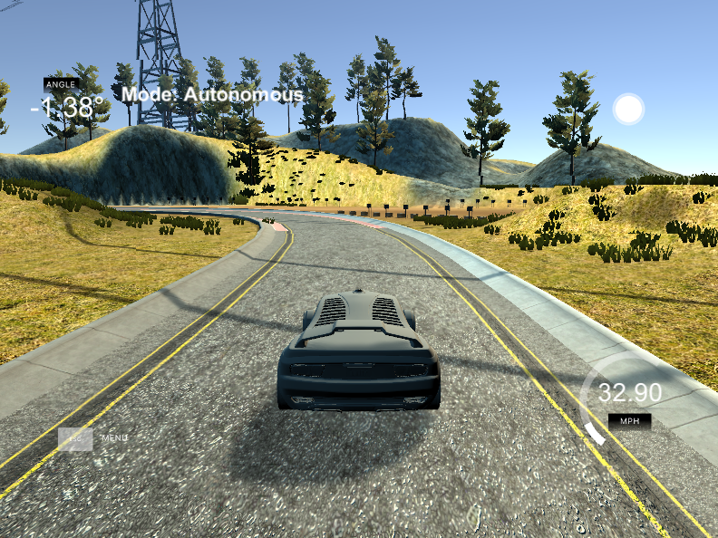

## PID controller for car driving simulator

In this project I have implemented a simple 
[PID controller](https://en.wikipedia.org/wiki/PID_controller)
that drives a car around a track in simulator, based on distance of the car
from center of the road. This project has been done as part of Udacity Self
Driving Car Nanodegree, term 2.

### PID error components

* *P* Proportional - this component corresponds directly to cross-track error,
  that is distance of car from center of the road. The value has to be
sufficiently high, such that steering is corrected hard enough, but on the
other hand has to be in good balance with D parameter, so that unwanted
oscillations around center of track are minimal. Chosen incorrectly, resulting
oscillations can be hard enough to throw car off track.

* *I* Integral - proportional to sum of deviations from road center. In
  idealized simulator world, this error is irrelevant.  The steering bias is
exactly zero, so there is no need to correct for it.  In other words, this
error asymptotically should be around zero.

* *D* Differential - proportional to rate of change
of P component.  This component helps with going into sharp turns (when
proportional error quickly increases). However, setting it to too high a value
introduces another kind of oscillations, when turning too hard in a harsh turn
has to be immediately countered on next action.

#### Hyperparameter tuning story reflection

* As stated above, I have decided to ignore (set to 0) the integral parameter due
  to simulator being idealized environment with no steering bias.
* I have started with lowering throttle and choosing P parameter manually such
  that car (more or less) stays on track, setting I and D parameters to 0. 
* Above step provided a reasonable starting value for model with throttle set back to 0.3. 
 I had to still slightly adjust up the P parameter to account for higher throttle.
* After this, I have started increasing D parameter in small increments until I have
found a version for which driving is (subjectively) the smoothest. From
certain point up, excessive steering caused by D correction makes it impossible for car
to accelerate and results in unsmooth path.

